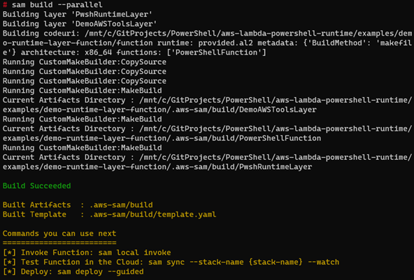

# Demo-s3-lambda-eventbridge

Demo to show an event-drive application in PowerShell.

This post expands on the functionality introduced with the PowerShell custom runtime for [AWS Lambda](https://aws.amazon.com/lambda/). See the blog post Extending PowerShell on AWS Lambda with other services for more information on adding PowerShell modules.

You can take also advantage of the event-driven nature of Lambda, which allows you to run Lambda functions in response to events. Events can include a file being uploaded to [Amazon S3](https://aws.amazon.com/s3/), a message placed on an [Amazon SQS](https://aws.amazon.com/sqs/) queue, a scheduled task using [Amazon EventBridge](https://aws.amazon.com/eventbridge/), or an HTTP request from [Amazon API Gateway](https://aws.amazon.com/api-gateway/). You can trigger a Lambda function from over 200 AWS services and software as a service (SaaS) applications and only pay for what you use.

## Demo application

A clothing printing company needs to manage its t-shirt size and color inventory. The printers store t-shirt orders for each day in a .CSV file. The inventory service is one service that needs to receive the .CSV file. It parses the file and, for each order, records the details to manage stock deliveries.

The stores upload the files to S3. This automatically invokes a PowerShell Lambda function, which is configured to respond to the S3 `ObjectCreated` event.  The Lambda function receives the S3 object location as part of the `$LambdaInput` event object. It uses the AWS Tools for PowerShell to download the file from S3. It parses the contents and, for each line in the .CSV file, sends the individual order details as an event to an EventBridge event bus.

In this example, there is a single rule to log the event to Amazon CloudWatch Logs to show the received event. You could extend this functionality to write different EventBridge rules. You could route each order, depending on the order details, to different targets. For example, you can send different color combinations to Amazon SQS queues which the dyeing service can read from to order dyes. You could send particular size combinations to another Lambda function which manages cloth orders.

The demo application uses the [AWS Serverless Application Model (AWS SAM)](https://aws.amazon.com/serverless/sam/) to deploy the following resources:

1. PowerShell custom runtime.
1. Additional Lambda layer containing the `AWS.Tools.Common`, `AWS.Tools.S3`, and `AWS.Tools.EventBridge` modules from [AWSTools for PowerShell](https://aws.amazon.com/powershell/). The layer ARN is stored in Parameter Store.
1. S3 bucket to store .CSV files.
1. Lambda function triggered by S3 upload.
1. Custom EventBridge event bus and rule to send events to CloudWatch Logs.

To build the custom runtime and the AWSTools for PowerShell layer, AWS SAM uses a Makefile. This downloads the specified version of PowerShell from <https://github.com/PowerShell/PowerShell/releases/> and the AWSTools from <https://sdk-for-net.amazonwebservices.com/ps/v4/latest/AWS.Tools.zip>

Makefiles are not natively supported in Windows. When using Windows, you can use either [Windows Subsystem for Linux (WSL)](https://docs.microsoft.com/en-us/windows/wsl/about), [Docker Desktop](https://docs.docker.com/get-docker/) or native PowerShell.

### Pre-requisites

* [AWS Serverless Application Model (AWS SAM)](https://aws.amazon.com/serverless/sam/)
* If building on Windows:
  * [Windows Subsystem for Linux (WSL)](https://docs.microsoft.com/en-us/windows/wsl/about) *or*
  * [Docker Desktop](https://docs.docker.com/get-docker/) *or*
  * [PowerShell for Windows](https://docs.microsoft.com/en-us/powershell/scripting/install/installing-powershell-on-windows)

Clone the repository and change into the example directory

```shell
git clone https://github.com/awslabs/aws-lambda-powershell-runtime
cd aws-lambda-powershell-runtime/examples/demo-s3-lambda-eventbridge
```

Use one of the *"Build"* options, A,B,C, depending on your operating system and tools.

### A. Build using Linux or WSL

Build the custom runtime, Lambda layer, and function packages using native Linux or WSL.

```shell
sam build --parallel
```



### B. Build using Docker

You can build the custom runtime, Lambda layer, and function packages using Docker. This uses a linux-based Lambda-like Docker container to build the packages. Use this option for Windows without WSL or as an isolated Mac/Linux build environment.

```shell
sam build --parallel --use-container
```


### C. Build using PowerShell for Windows

You can use native PowerShell for Windows to download and extract the custom runtime and Lambda layer files. This performs the same file copy functionality as the Makefile. It adds the files to the source folders rather than a build location for subsequent deployment with AWS SAM. Use this option for Windows without WSL or Docker.

```shell
.\build-layers.ps1
```


### Deploying to the AWS Cloud

Use AWS SAM to deploy the resources to your AWS account. Run a guided deployment to set the default parameters for the first deploy.

```shell
sam deploy -g
```

For subsequent deployments, you can use `sam deploy`.

Enter a **Stack Name**.

Enter a unique S3 **SourceBucketName**.
You can use your AWS Account number to generate a unique name, for example `demo-s3-lambda-eventbridge-bucket-ACCOUNT_NUMBER`.

Accept the remaining initial defaults.


AWS SAM deploys the infrastructure and outputs the details of the resources.


## Testing the event-driven application

Use the AWS CLI or AWS Tools for PowerShell to copy the sample .CSV file to S3. Replace `BUCKET_NAME` with your S3 `SourceBucket` Name.

### AWS CLI

````shell
aws s3 cp .\test.csv s3://BUCKET_NAME
````

### AWSTools for PowerShell

````shell
Write-S3Object -BucketName BUCKET_NAME -File .\test.csv
````

The S3 file copy generates an S3 notification event. This invokes the Lambda function, passing the S3 file location details as part of the function `$LambdaInput` event object.

The function downloads the S3 .CSV file, parses the contents and sends the individual lines to EventBridge, which logs the events to CloudWatch Logs.

Navigate to the CloudWatch Logs group `/aws/events/demo-s3-lambda-eventbridge`.

You can see the individual events in logged from the S3 object.
