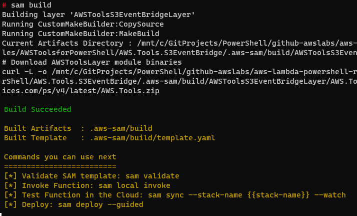

# AWS Tools for PowerShell

You can build Lambda layers containing all or select modules from the AWS Tools for PowerShell.

You add one or more layers to your functions, along with the [PowerShell custom runtime](../../powershell-runtime/).

The process is a two stage process, first build the layer(s) and then deploy the layers to your AWS account.

Windows does not natively support Makefiles. When using Windows, you can use either [Windows Subsystem for Linux (WSL)](https://docs.microsoft.com/en-us/windows/wsl/about), [Docker Desktop](https://docs.docker.com/get-docker/) or native PowerShell.

## Pre-requisites

* [AWS Serverless Application Model (AWS SAM)](https://aws.amazon.com/serverless/sam/) or [AWS Command Line Interface (AWS CLI)](https://docs.aws.amazon.com/cli/latest/userguide/getting-started-install.html)

* If building on Windows:
  * [Windows Subsystem for Linux (WSL)](https://docs.microsoft.com/en-us/windows/wsl/about) *or*
  * [Docker Desktop](https://docs.docker.com/get-docker/) *or*
  * [PowerShell for Windows](https://docs.microsoft.com/en-us/powershell/scripting/install/installing-powershell-on-windows)

## Build stage

Clone the repository and change into the modules directory.

```shell
git clone https://github.com/awslabs/aws-lambda-powershell-runtime
cd aws-lambda-powershell-runtime
cd powershell-modules/AWSToolsforPowerShell
```

Change into the specific module collection directory that matches the modules you wish to install.

To install all modules, use [AWS.Tools.All](https://github.com/awslabs/aws-lambda-powershell-runtime/tree/main/powershell-modules/AWSToolsforPowerShell/AWS.Tools.All)

To install only the AWS.Tools.Common modules, use [AWS.Tools.Common](https://github.com/awslabs/aws-lambda-powershell-runtime/tree/main/powershell-modules/AWSToolsforPowerShell/AWS.Tools.Commonl)

To install select AWS.Tools modules, you can amend the modules imported.

The following example shows importing the modules for [S3 and EventBridge](https://github.com/awslabs/aws-lambda-powershell-runtime/tree/main/powershell-modules/AWSToolsforPowerShell/AWS.Tools.S3EventBridge)

```shell
cd AWS.Tools.S3EventBridge
```

You can amend the [makefile](https://github.com/awslabs/aws-lambda-powershell-runtime/blob/main/powershell-modules/AWSToolsforPowerShell/AWS.Tools.S3EventBridge/Makefile) or [build-AWSToolsLayer.ps1](https://github.com/awslabs/aws-lambda-powershell-runtime/blob/main/powershell-modules/AWSToolsforPowerShell/AWS.Tools.S3EventBridge/build-AWSToolsLayer.ps1) files to selectively include or exclude any of the AWS Tools for PowerShell modules.

Use one of the *"Build"* options, A,B,C, depending on your operating system and tools.

### A) Build using Linux or WSL with AWS SAM

Build the Lambda layer using native Linux or WSL.

*Note:* The `make` package is required for `sam build` to work. When building in Linux environments, including WSL, you may need to install `make` before this command will work.

```shell
sam build
```



### B) Build using Docker with AWS SAM

You can build the Lambda layer using Docker. This uses a Linux-based Lambda-like Docker container to build the packages. Use this option for Windows without WSL or as an isolated Mac/Linux build environment.

```shell
sam build --use-container
```

### C) Build using PowerShell for Windows

You can use native PowerShell for Windows to download and extract the Lambda layer files. This performs the same file copy functionality as the Makefile. It adds the files to the `buildlayer` folder rather than a temporary build location for subsequent deployment with AWS SAM or the AWS CLI. Use this option for Windows without WSL or Docker.

```shell
.\build-AWSToolsLayer.ps1
```


## Deploy stage

Use one of the *"Deploy"* options, A,B, to deploy the layer depending on your tools.

### A) Deploy using AWS SAM

Use AWS SAM to deploy the resources to your AWS account. You can use AWS SAM even if you didn't use the tool in the build phase. Deploy either of the build A), B), or C) options. Run a guided deployment to set the default parameters for the first deploy.

```shell
sam deploy -g
```

For subsequent deployments you can use `sam deploy`.

Enter a **Stack Name** such as `AWSToolsCommon` and accept the remaining initial defaults.


AWS SAM deploys the infrastructure and outputs the details of the layer. Note the ARN value to add to your functions.


#### Cleanup

To delete the layer created, run the following and confirm that you want to delete the resources that were created by this template.

````shell
sam delete
````

### B) Deploy using AWS CLI

If you built the layer using PowerShell for Windows, you can deploy to AWS without requiring AWS SAM.

Zip up the layer files.

```shell
cd buildlayer
zip -FSr ../AWS.Tools.S3EventBridge.zip .
cd ..
```

Use the AWS CLI to create the layer. Replace the `--layer-name`, and `--description` values.

```shell
aws lambda publish-layer-version --layer-name "AWSToolsS3EventBridge"  --zip-file "fileb://AWS.Tools.S3EventBridge.zip" --description "Layer containing AWSTools.S3EventBridge" --compatible-runtimes provided.al2
```

Note the `LayerVersionArn` value to add to your functions.


#### Cleanup

Use the AWS CLI to delete the layer version created. If you need to delete all versions, repeat the command for all published versions.  Replace the `--layer-name`, and `--version-number` values.

````shell
aws lambda delete-layer-version --layer-name "AWSToolsS3EventBridge" --version-number 1
````
